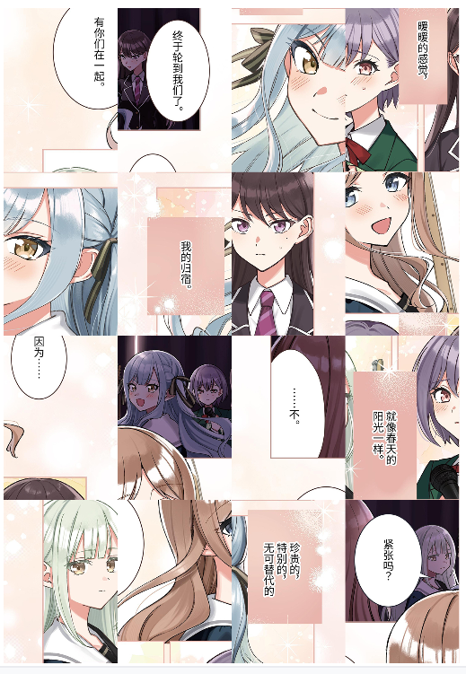
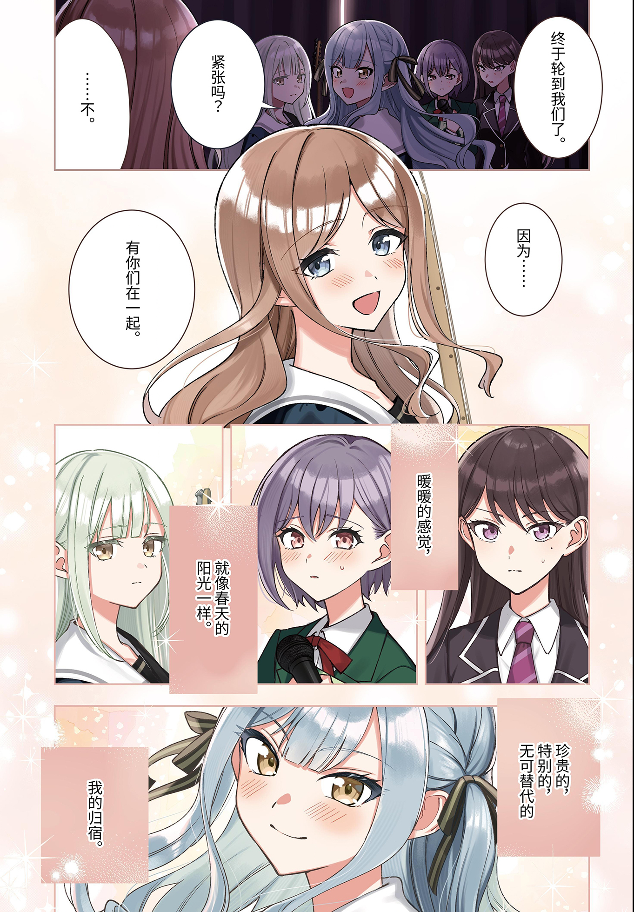

# Readme
## 简介
这是一个 Python 小工具，用来还原被混淆的漫画图片。

众所周知，在武士道旗下的漫画连载平台 Comic Growl 上有 MyGO 和 Ave Mujica 的连载漫画，并且可以免费阅读大部分。因此，我想要将这些漫画下载收藏。但是，直接下载的漫画图片是拼图式的图片碎片（**Tile Sheet**），并不是漫画的完整页面，而是将一页内容分成了若干小块打乱后拼接在一起，这是一种常见的**反爬虫混淆技术**。

所以，这个项目就诞生了。原理很简单，先切片再重排序。

这是仅供我个人使用的小工具，并且 **Powered by GPT**，所以整个 项目/仓库 看上去会很“粗糙”。如果你愿意，你可以提交 PR.

## 使用方法
### 前提条件
- Python
- 下载某一话的所有图片，文件名为 `master-xxxxx-xx.jpg`
- 下载该话的 `contentsInfo.json` 文件

### 运行
将图片和 json 文件放入 origin 文件夹中，运行 `main.py`，处理好的图片会生成在当前目录的 restored 文件夹下。
